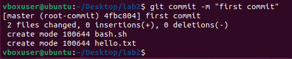

**Державний вищий навчальний заклад
Ужгородський національний університет
Факультет інформаційних технологій**

**ЛАБОРАТОРНА РОБОТА №6**

**Тема:** Використання Github Actions

Виконав студент III курсу Рубіш Едуард Юрійович

Напрям: ІПЗ 2.1

**Ужгород-2022**

  

**Хід роботи**

&nbsp;

**1. Створення інстансу EC2 для деплоя проекта**

&nbsp;

_Скріншот 1. Готовий інстанс_

&nbsp;

**2. Створення репозиторію з простю HTML-сторінкою**

&nbsp;

_Скріншот 2. Репозиторій зі сторінкою_

&nbsp;

**3. Налаштування ранера для роботи Github Actions**

&nbsp;

_Скріншот 3.1. Завантаження ранера_

&nbsp;

_Скріншот 3.2. Налаштування ранера_

&nbsp;

_Скріншот 3.3. Запуск ранера_

&nbsp;

**4. Створення робочого процесу для автоматизованого виконання завдань**

&nbsp;

_Скріншот 4. Створення файлу static.yml_

&nbsp;

**5. Установка і запуск сервера nginx**

&nbsp;

_Скріншот 5.1. Завантаження nginx_

&nbsp;

_Скріншот 5.2. Налаштування відображуваної сторінки_

&nbsp;

_Скріншот 5.3. Запуск сервера_

&nbsp;

**6. Видача потрібних прав для роботи nginx**

&nbsp;

_Скріншот 6. Редагування прав доступу_

&nbsp;

**7. Демонстрація працюючого Github Actions (http://3.123.154.82)**

&nbsp;

_Скріншот 7.1. Початковий вигляд сторінки_

&nbsp;

_Скріншот 7.2. Редагування сторінки_

&nbsp;

_Скріншот 7.3. Модифікована сторінка_
