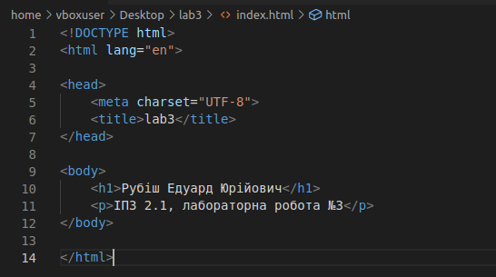
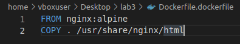

**Державний вищий навчальний заклад
Ужгородський національний університет
Факультет інформаційних технологій**

**ЛАБОРАТОРНА РОБОТА № 1**

**Тема:** Ознайомлення із командами терміналу Linux та командною оболонкою Bash

Виконав студент III курсу

Напрям: ІПЗ 2.1

Рубіш Едуард Юрійович

**Ужгород-2022**

1. Проробити команди, які розглядались на лекції

Зміна каталогу: cd <Ім'я каталогу>

До минулого рівня: cd ..

До кореневого рівня: cd /

Перехід в домашній каталог користувача: cd ~

Список файлів: ls

Створити порожній файл: touch <Ім'я файлу>

Створити новий каталог: mkdir <ім'я каталогу

Видалити файл(и) (dir): rm <ім'я\_файлу>

Запуск від імені користувача ROOT: sudo <команда>

Вимкнення: shutdown -h now (тільки root)

Перезавантаження: shutdown -r now (тільки root)

Відомості про команду (програму): man <команда>

Зміна користувача: su <ім'я користувача

Очистити вікно терміналу: clear

Інформація про архітектуру системи та ядро: uname -a

Інформація про процесор: lscpu

Інформація про запущені процеси: ps

Інформація про запущені процеси в реальному часі: top

Інформація про конфігурацію мережевих адаптерів: ip addr show

Інформація про поточного користувача: id

ps aux | grep apache - показати всі запущені потоки процесу apache

uname -a > mysystem.info - інформація про систему та ядро не буде виводитися на екран, а буде збережена у файлі mysystem.info

id - показати інформацію про користувача (з групами)

groups - показати інформацію про групи, до яких належить користувач

usermod - змінити обліковий запис користувача

ls -al – показати всі файли та права доступу до них

chown – change file owner and group

chmod – change file mode bits

ssh-keygen - програма для генерації та управління ключами аутентифікації

ssh-copy-id - використання локально доступних ключів для авторизації входів на віддаленій машині

2. Вивести через термінал список користувачів та інформацію про ваш комп’ютер та ядро лінукса.

Вивід всіх користувачів за допомогою команди cat etc/passwd, інформації про систему за допомогою команди lscpu

3. Використовуючи bash створити сценарій перевірки імені користувача та наявності файлу hello.txt, якщо такий існує то вивести Hello user.name який видасть система, якщо файлу не існує тоді вивести Hello назва вашої групи та ваше ПІБ.

