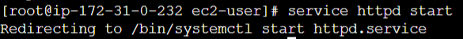

**Державний вищий навчальний заклад
Ужгородський національний університет
Факультет інформаційних технологій**

**ЛАБОРАТОРНА РОБОТА № 5**

**Тема:** Деплой проекту на AWS EC2

Виконав студент III курсу

Напрям: ІПЗ 2.1

Рубіш Едуард Юрійович

**Ужгород-2022**

**Хід роботи**

1. Зареєструватись на AWS.

Скріншот 1. Панель керування AWS

1. Створити інстанс EC2.

Скріншот 2. Панель керування інстансами

1. Задеплоїти проект (може бути html сторінка) і скинути посилання в звіт для можливості перегляду.

Скріншот 3.1, 3.2. Встановлення і запуск Apache

Скріншот 3.3. Створення сторінки для деплоя

Скріншот 3.4. Деплойнутий проект; [посилання](http://3.121.232.245/)
